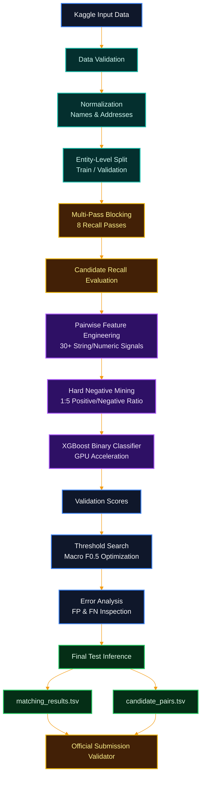

# 01000001 01101101 01100001 01111010 01101111 01101110 00100000 01001101 01001100 00100000 01000011 01101000 01100001 01101100 01100101 01101110 01100111 01100111 01100101

# Business Entity Resolution Challenge — ML Matching Pipeline

> **Amazon ML Challenge 2026 — Business Entity Resolution Challenge**
> Scalable business record linkage using multi-pass blocking, pairwise feature engineering, hard-negative mining, and XGBoost.

---

## Overview

This project solves a **business entity resolution / record linkage** problem across three data sources.

The objective is to determine which records from **Source 2** and **Source 3** correspond to the same real-world business represented by each **Source 1** entity.

A Source 1 entity can have:

* zero matches
* one match
* multiple matches

Therefore, this is **not a one-to-one matching problem**.

### ML Problem Formulation

There is no direct target column in `train_source1.tsv`.

The supervised learning problem is created at the **candidate-pair level**:

```text
Source 1 record
      +
Candidate Source 2/3 record
      ↓
Pairwise features
      ↓
Binary classifier
      ↓
P(same real-world business)
```

Example:

```text
S1-100
ABC Restaurant
12 MG Road Bangalore
India

S2-900
ABC Restaurant Pvt Ltd
12 M.G. Road Bengaluru
India

            ↓

(S1-100, S2-900) → label = 1
```

A candidate pair that is not present in the ground truth is treated as a non-match:

```text
label = 0
```

---

# Pipeline Architecture



```text
                       Kaggle Input
                            │
                            ▼
                 ┌─────────────────────┐
                 │   Data Validation   │
                 └──────────┬──────────┘
                            │
                            ▼
                 ┌─────────────────────┐
                 │    Normalization    │
                 │ Names / Addresses   │
                 └──────────┬──────────┘
                            │
                            ▼
                 ┌─────────────────────┐
                 │ Entity-Level Split  │
                 │ Train / Validation  │
                 └──────────┬──────────┘
                            │
                            ▼
                 ┌─────────────────────┐
                 │  Multi-Pass        │
                 │     Blocking       │
                 └──────────┬──────────┘
                            │
                            ▼
                 ┌─────────────────────┐
                 │ Candidate Recall   │
                 │   Evaluation       │
                 └──────────┬──────────┘
                            │
                            ▼
                 ┌─────────────────────┐
                 │ Pairwise Features  │
                 └──────────┬──────────┘
                            │
                            ▼
                 ┌─────────────────────┐
                 │ Hard Negatives     │
                 └──────────┬──────────┘
                            │
                            ▼
                 ┌─────────────────────┐
                 │      XGBoost       │
                 │ Binary Classifier  │
                 └──────────┬──────────┘
                            │
                            ▼
                 ┌─────────────────────┐
                 │ Validation Scores  │
                 └──────────┬──────────┘
                            │
                            ▼
                 ┌─────────────────────┐
                 │ Threshold Search   │
                 │     F0.5           │
                 └──────────┬──────────┘
                            │
                            ▼
                 ┌─────────────────────┐
                 │  Error Analysis    │
                 └──────────┬──────────┘
                            │
                            ▼
                    Final Test Inference
                            │
                 ┌──────────┴───────────┐
                 ▼                      ▼
       matching_results.tsv     candidate_pairs.tsv
                 │                      │
                 └──────────┬───────────┘
                            ▼
                    Official Validator
```

### Core principle

> **Blocking creates the search space. XGBoost decides which candidates are true matches.**

A true match that is missed during blocking cannot be recovered by the classifier later.

---

# Repository Structure

```text
business-entity-resolution/
│
├── output/
│   ├── matching_results.tsv
│   └── candidate_pairs.tsv
│
├── code/
│   └── business_entity_resolution/
│       ├── src/
│       │   ├── config.py
│       │   ├── io_utils.py
│       │   ├── cleaning.py
│       │   ├── cleaning_eval.py
│       │   ├── ground_truth.py
│       │   ├── splitting.py
│       │   ├── blocking.py
│       │   ├── blocking_eval.py
│       │   ├── pair_dataset.py
│       │   ├── features.py
│       │   ├── training.py
│       │   ├── evaluation.py
│       │   ├── threshold.py
│       │   ├── error_analysis.py
│       │   ├── inference.py
│       │   ├── submission.py
│       │   └── pipeline.py
│       │
│       ├── README.md
│       └── requirements.txt
│
├── ml_challenge.ipynb
├── Documentation_template.md
└── README.md
```

## Module Responsibilities

| Module              | Responsibility                                         |
| ------------------- | ------------------------------------------------------ |
| `config.py`         | Configuration, paths and model parameters              |
| `io_utils.py`       | TSV loading, saving and chunked/disk-backed processing |
| `cleaning.py`       | Business name/address normalization                    |
| `cleaning_eval.py`  | Cleaning quality and normalization diagnostics         |
| `ground_truth.py`   | Ground-truth parsing and pair labels                   |
| `splitting.py`      | Entity-level train/validation splitting                |
| `blocking.py`       | Multi-pass candidate generation                        |
| `blocking_eval.py`  | Candidate recall and blocking efficiency               |
| `pair_dataset.py`   | Positive and negative pair construction                |
| `features.py`       | Pairwise feature generation                            |
| `training.py`       | XGBoost training                                       |
| `evaluation.py`     | Entity-level evaluation                                |
| `threshold.py`      | Threshold optimization                                 |
| `error_analysis.py` | FP/FN analysis                                         |
| `inference.py`      | Final candidate scoring                                |
| `submission.py`     | Submission file generation                             |
| `pipeline.py`       | End-to-end orchestration                               |

---

# Dataset

All challenge files are **TSV files**.

```python
pd.read_csv(path, sep="\t")
```

## Record schema

```text
entity_id
business_name
business_address
country
```

Entity ID prefixes:

```text
S1-... → Source 1
S2-... → Source 2
S3-... → Source 3
```

## Ground Truth

Training ground truth contains:

```text
source1_entity_id
matched_entity_ids
```

`matched_entity_ids` is a comma-separated list.

An empty value means that the Source 1 entity has no known match.

---

# Data Cleaning and Normalization

Entity resolution requires careful normalization.

The pipeline does **not** remove duplicate business names or duplicate addresses.

For example:

```text
Primary Care Group
Primary Care Group
Primary Care Group
```

may represent different businesses.

Therefore:

```text
Raw Record
    ↓
Normalized Representation
```

rather than:

```text
Raw Record
    ↓
Delete Duplicate
```

The original values remain available.

## Business Name Normalization

Example:

```text
"ABC Pvt. Ltd."
        ↓
"abc pvt ltd"
```

Two representations are maintained:

```text
business_name_norm
business_name_core
```

The core representation removes selected trailing legal/business suffixes.

## Address Normalization

Example:

```text
"12, M.G. Road, Bengaluru"
        ↓
"12 mg road bengaluru"
```

Important address numbers are preserved.

Examples:

```text
12
560001
101
B12
```

Useful derived fields include:

```text
address_numbers
name_length
address_length
name_token_count
address_token_count
name_missing
address_missing
country_missing
```

---

# Open-Set Country Handling

Country must be treated as an **open-set string value**.

The system must not assume that only the countries present in training can appear during testing.

Instead of hard-coding:

```text
US
India
```

the model uses a generic feature:

```text
country_match
```

This supports additional countries appearing in the test set.

---

# Candidate Generation

Comparing every Source 1 entity against every Source 2 and Source 3 record would create a huge search space.

The solution therefore uses **multi-pass blocking**.

## Blocking Passes

### Pass 1 — Exact Normalized Name

```text
country + business_name_norm
```

### Pass 2 — Exact Core Name

```text
country + business_name_core
```

### Pass 3 — Address Token Blocking

```text
country + informative address token
```

### Pass 4 — Numeric Address Blocking

Use shared address numbers.

```text
12
560001
101
B12
```

### Pass 5 — Rare Name Token Blocking

Rare name tokens provide useful blocking keys while limiting large generic blocks.

### Pass 6 — Rare Address Token Blocking

Useful for records with weak name agreement but strong address evidence.

### Pass 7 — Fuzzy Name Retrieval

Use RapidFuzz inside manageable blocks rather than a global all-to-all fuzzy search.

### Pass 8 — Fuzzy Address Retrieval

Use fuzzy address retrieval inside manageable candidate blocks.

The final candidate set is the union:

```text
Name Candidates
       ∪
Address Candidates
       ∪
Numeric Candidates
       ∪
Token Candidates
       ↓
Final Candidate Set
```

---

# Candidate Recall

Blocking is evaluated using:

```text
Candidate Recall =
True Matches Found in Candidate Set
------------------------------------
         All True Matches
```

The target is approximately:

```text
98–99%+ candidate recall
```

while keeping candidate volume computationally manageable.

## Blocking Metrics

| Metric                  | Purpose                     |
| ----------------------- | --------------------------- |
| Candidate recall        | Measures true-pair coverage |
| Average candidates / S1 | Typical workload            |
| Median candidates / S1  | Central workload            |
| P95 candidates / S1     | Tail workload               |
| Maximum candidates / S1 | Worst case                  |
| Runtime                 | Computational cost          |
| Memory                  | Scalability                 |

The goal is not simply maximum recall.

The goal is:

> **High candidate recall + manageable candidate volume + practical runtime**

---

# Pairwise Feature Engineering

After blocking, each candidate pair is converted into numerical features.

## Name Features

```text
name_exact
name_core_exact
name_char_similarity
name_levenshtein
name_token_sort_ratio
name_token_set_ratio
name_jaccard
name_containment
name_length_ratio
common_name_tokens
```

## Address Features

```text
address_exact
address_char_similarity
address_levenshtein
address_token_sort_ratio
address_token_set_ratio
address_jaccard
address_containment
address_length_ratio
```

## Numeric Address Features

```text
numeric_overlap
numeric_jaccard
shared_number_count
number_count_difference
```

## Additional Features

```text
country_match
missingness indicators
source_is_s2
source_is_s3
```

## Interaction Features

Examples:

```text
name_similarity × address_similarity

min(name_similarity, address_similarity)

max(name_similarity, address_similarity)
```

Example:

```text
Name similarity = 0.95
Address similarity = 0.90
```

is stronger evidence than:

```text
Name similarity = 0.95
Address similarity = 0.15
```

---

# Hard Negative Mining

Random negative examples are not enough for entity resolution.

The classifier must learn difficult non-match cases.

Examples:

```text
Similar name
Different address

Same country
Similar name
Different entity

Similar address
Different business

High text similarity
Not a real match

Shared address number
Different business
```

Initial training target:

```text
1 positive : 3–5 negatives
```

A large portion of the negatives should be difficult **hard negatives** rather than easy random examples.

---

# Machine Learning Model

The primary model is an:

## XGBoost Binary Classifier

Input:

```text
Pairwise features
```

Output:

```text
P(same real-world business)
```

## Baseline Configuration

```python
objective = "binary:logistic"
eval_metric = "aucpr"

max_depth = 6
eta = 0.05
min_child_weight = 3
subsample = 0.8
colsample_bytree = 0.8
gamma = 0.1
reg_alpha = 0.1
reg_lambda = 2
```

These values are starting points.

Potential tuning parameters:

```text
max_depth
learning rate
min_child_weight
subsample
colsample_bytree
gamma
L1 regularization
L2 regularization
boosting rounds
```

---

# Evaluation

The competition uses:

```text
Fβ where β = 0.5
```

Formula:

```text
F0.5 = (1.25 × Precision × Recall)
       --------------------------------
       (0.25 × Precision + Recall)
```

The metric is calculated **per Source 1 entity** and then macro-averaged.

Therefore, model selection should ultimately follow:

```text
XGBoost
   ↓
Validation probabilities
   ↓
Threshold sweep
   ↓
Entity-level macro F0.5
```

rather than optimizing accuracy alone.

---

# Threshold Optimization

The XGBoost model outputs probabilities:

```text
0.12
0.27
0.63
0.91
...
```

A threshold converts probabilities into final matches.

The pipeline searches a validation range such as:

```text
0.10 → 0.99
```

For each threshold:

```text
score >= threshold
        ↓
Predicted match
```

Then calculate:

```text
macro F0.5
precision
recall
singleton correctness
false positives
false negatives
predicted match count
```

The final threshold is selected from validation performance.

There is no assumption that:

```text
threshold = 0.5
```

is optimal.

---

# Zero, One, or Many Matches

The system does **not** force exactly one match for every S1 entity.

Valid outputs include:

```text
S1-001 → []
```

```text
S1-002 → [S2-100]
```

```text
S1-003 → [S2-101, S2-102, S3-200]
```

This is an important property of the solution.

---

# Singleton Handling

Some Source 1 entities legitimately have no S2/S3 match.

Example:

```text
Actual:
[]

Predicted:
[]
```

is correct.

But:

```text
Actual:
[]

Predicted:
[S2-123]
```

is a false merge.

Because evaluation is entity-level, singleton errors are explicitly monitored during validation and error analysis.

---

# Validation Strategy

The train/validation split is performed at the **Source 1 entity level**.

Recommended baseline:

```text
80% Train
20% Validation

random_state = 42
```

The same Source 1 entity must never occur in both datasets.

Where practical, stratification can consider:

```text
country
+
number-of-matches bucket
```

This better reflects the entity-level scoring structure.

Ground truth is used to label candidate pairs and evaluate the validation set, not to generate test candidates.

---

# Error Analysis

Error analysis is a major part of the improvement process.

## False Positives

```text
Model predicts match
Ground truth says non-match
```

Inspect highest-probability false positives.

Look for patterns such as:

* generic business names
* similar names with different addresses
* shared addresses
* shared street numbers
* over-aggressive normalization

## False Negatives

```text
Model predicts non-match
Ground truth says match
```

Inspect lowest-probability true matches.

Look for:

* spelling variations
* transliteration
* abbreviations
* missing fields
* significant name changes
* address formatting differences

## Improvement Loop

```text
Baseline
   ↓
Measure F0.5
   ↓
Error Analysis
   ↓
Identify Failure Pattern
   ↓
Improve Blocking / Features / Model
   ↓
Retrain
   ↓
Threshold Sweep
   ↓
Measure Again
```

The goal is controlled experimentation rather than changing many components randomly.

---

# Kaggle Execution Strategy

The current implementation is designed to run on **Kaggle**.

## Data Location

Input datasets:

```text
/kaggle/input/
```

Runtime artifacts:

```text
/kaggle/working/
```

Kaggle Input should be treated as read-only.

## Compute Strategy

### CPU

Used for:

```text
TSV loading
data validation
normalization
blocking
RapidFuzz
candidate bookkeeping
```

### GPU

Used primarily for:

```text
XGBoost training
```

### Memory Strategy

For large stages:

* process data in chunks
* avoid giant dense similarity matrices
* use disk-backed intermediate artifacts when practical
* release large objects between stages
* prefer `float32` unless another precision is explicitly benchmarked and validated

---

# Runtime Artifacts

A typical Kaggle working directory:

```text
/kaggle/working/run/
├── preprocessing/
├── candidates/
├── features/
├── models/
├── predictions/
├── experiments/
└── output/
```

Large intermediate files should stay in runtime storage rather than being committed to GitHub.

---

# Reproducibility

Each experiment should record:

```text
random seed
configuration
blocking version
feature version
model version
threshold
validation metrics
```

This allows experiments to be reproduced and compared.

---

# Final Output

The challenge requires:

```text
output/
├── matching_results.tsv
└── candidate_pairs.tsv
```

## matching_results.tsv

Expected format:

```text
source1_entity_id    matched_entity_ids
```

Requirements:

* exactly one row per test Source 1 entity
* empty match list is valid
* no duplicate match IDs
* only valid S2/S3 IDs
* zero, one, or many matches allowed

## candidate_pairs.tsv

Expected format:

```text
source1_entity_id    candidate_entity_ids
```

This file represents the **final candidate set supplied to the matching model**.

Every predicted match must be contained in the corresponding candidate set.

---

# Official Validation

Before submitting:

```bash
python3 utils/validate_submission.py \
  --matching output/matching_results.tsv \
  --candidate output/candidate_pairs.tsv \
  --test-dir dataset/test
```

The official validator should pass before packaging the submission.

---

# Submission Structure

Final package:

```text
<team_name>_submission.zip

├── output/
│   ├── matching_results.tsv
│   └── candidate_pairs.tsv
│
├── code/
│   └── business_entity_resolution/
│       ├── src/
│       ├── README.md
│       └── requirements.txt
│
└── Documentation_template.md
```

---

# Competition Constraints

The solution follows the challenge's fair-play requirements.

The system should not use:

* external business lookup services
* government/business databases
* commercial entity-resolution APIs
* geocoding APIs
* external internet data augmentation

The model should learn from the provided challenge data.

The final model must also satisfy the applicable challenge restrictions for model size and licensing.

---

# Quick Start

## 1. Clone

```bash
git clone <your-github-repository-url>
cd business-entity-resolution
```

## 2. Install Dependencies

```bash
pip install -r code/business_entity_resolution/requirements.txt
```

## 3. Configure Dataset Paths

Keep dataset paths configurable.

Expected logical structure:

```text
<dataset-root>/
└── dataset/
    ├── train/
    └── test/
```

For Kaggle, the dataset should be located under:

```text
/kaggle/input/
```

## 4. Run the Notebook

Use:

```text
ml_challenge.ipynb
```

as the primary orchestration and experimentation interface.

Core implementation lives under:

```text
code/business_entity_resolution/src/
```

## 5. Validate

```bash
python3 utils/validate_submission.py \
  --matching output/matching_results.tsv \
  --candidate output/candidate_pairs.tsv \
  --test-dir dataset/test
```

---

# Technology Stack

| Category            | Technology                      |
| ------------------- | ------------------------------- |
| Language            | Python                          |
| Data Processing     | Pandas, NumPy                   |
| Fuzzy Matching      | RapidFuzz                       |
| Text Similarity     | TF-IDF / token-based similarity |
| Machine Learning    | XGBoost                         |
| Compute Environment | Kaggle                          |
| GPU                 | NVIDIA T4                       |
| Input Format        | TSV                             |
| Output Format       | TSV                             |
| Version Control     | Git / GitHub                    |

---

# Key Design Decisions

## Why Pairwise Classification?

The fundamental question is:

```text
Are these two records the same real-world business?
```

Therefore, the ML model predicts a probability for each candidate pair.

## Why Blocking?

Without blocking, the number of comparisons becomes too large.

Blocking reduces the search space.

## Why Multi-Pass Blocking?

Different blocking methods handle different types of noise.

Combining them improves candidate recall.

## Why Hard Negatives?

The most difficult errors occur when two records look similar but refer to different businesses.

Hard negatives teach the model to distinguish these cases.

## Why Threshold Optimization?

The final evaluation metric is entity-level macro F0.5.

Therefore, probability threshold selection is part of the model-selection process.

---

# Optimization Priorities

The project focuses on three major optimization areas.

### 1. Blocking Recall

```text
No candidate
    ↓
No chance of recovery
```

### 2. Hard Negatives

```text
Easy negatives
    ↓
Easy classifier
    ↓
Weak protection against false merges
```

### 3. Threshold

```text
Predicted probabilities
    ↓
Threshold search
    ↓
Entity-level macro F0.5
```

---

# Development Roadmap

```text
[1] Data Validation
        ↓
[2] Normalization
        ↓
[3] Ground Truth Parsing
        ↓
[4] Entity-Level Train/Validation Split
        ↓
[5] Multi-Pass Blocking
        ↓
[6] Candidate Recall Evaluation
        ↓
[7] Feature Engineering
        ↓
[8] Hard Negative Mining
        ↓
[9] XGBoost Baseline
        ↓
[10] Threshold Optimization
        ↓
[11] Error Analysis
        ↓
[12] Pipeline Improvements
        ↓
[13] Final Test Inference
        ↓
[14] Official Validation
        ↓
[15] Final Submission
```

---

# Engineering Principles

* Preserve raw data.
* Normalize instead of deleting legitimate duplicates.
* Treat country as an open-set value.
* Split data by entity to prevent leakage.
* Measure candidate recall before model optimization.
* Prefer scalable blocking over global all-to-all matching.
* Use hard negatives for difficult cases.
* Optimize the actual competition metric.
* Do not force one-to-one matching.
* Explicitly monitor singleton false positives.
* Keep final candidate sets reproducible.
* Separate runtime artifacts from source code.
* Keep configuration reproducible.
* Validate outputs before submission.

---

# Project Status

```text
✅ Problem formulation
✅ End-to-end pipeline design
✅ Data normalization strategy
✅ Multi-pass blocking strategy
✅ Candidate recall methodology
✅ Pairwise feature engineering
✅ Hard-negative strategy
✅ XGBoost baseline
✅ Entity-level F0.5 evaluation
✅ Threshold optimization
🔄 Full-scale Kaggle experimentation
🔄 Blocking optimization
🔄 Feature tuning
🔄 Model tuning
🔄 Error analysis
🔄 Final submission
```

---

# Author

**Bharath**

Computer Science & Engineering
PES University, Bengaluru

GitHub: [@BharathPESU](https://github.com/BharathPESU)

---

# License

Code licensing for the final competition submission should comply with the challenge's permitted license requirements.
