# 01000001 01101101 01100001 01111010 01101111 01101110 00100000 01001101 01001100 00100000 01000011 01101000 01100001 01101100 01101100 01100101 01101110 01100111 01100101

Welcome to the **Amazon ML Challenge 2026 — Business Entity Resolution** repository. 

This repository contains an end-to-end Machine Learning pipeline designed for **Kaggle 2×T4 GPU** environments to resolve business entities across multiple noisy sources. 

---

## 🏗️ Architecture & ML Pipeline Workflow

The solution formulates entity resolution as a **candidate-pair binary classification problem**. We use a heavily optimized, 8-pass blocking strategy followed by 30+ pairwise feature extractions and a GPU-accelerated XGBoost classifier.

```mermaid
flowchart TD
    %% Define Styles
    classDef data fill:#f9f9f9,stroke:#333,stroke-width:2px;
    classDef process fill:#e1f5fe,stroke:#03a9f4,stroke-width:2px;
    classDef eval fill:#fff3e0,stroke:#ff9800,stroke-width:2px;
    classDef output fill:#e8f5e9,stroke:#4caf50,stroke-width:2px;

    A[Raw Kaggle Input Files]:::data --> B(Stage 1: Load Data):::process
    B --> C(Stage 2: Clean Data & Normalization):::process
    C --> C_EVAL[Cleaning Quality Audit]:::eval
    C_EVAL --> D(Stage 3: Train/Val Split):::process
    
    D --> E(Stage 4: Generate Candidates / 8-Pass Blocking):::process
    E --> F[Candidate Recall Evaluation]:::eval
    
    F --> G(Stage 6: Build Hard-Negative Training Pairs):::process
    G --> H(Stage 7: Extract 30+ Pairwise Features):::process
    H --> I(Stage 8: Train XGBoost Model on GPU):::process
    
    I --> J(Stage 9: Score Validation Set):::process
    J --> K(Stage 10: Optimize Threshold for Macro F0.5):::process
    K --> L[Error Analysis / FP & FN Inspection]:::eval
    
    L --> M(Stage 12: Generate Test Candidates):::process
    M --> N(Stage 13: Build Test Features):::process
    N --> O(Stage 14: Run GPU Test Inference):::process
    
    O --> P(Stage 15: Create Submission Files):::process
    P --> Q[matching_results.tsv & candidate_pairs.tsv]:::output
```

---

## ⚡ Technical Highlights (Kaggle 2xT4 Optimization)

This codebase is heavily restructured to guarantee stability under strict Kaggle resource budgets (13GB CPU RAM, Dual 16GB T4 GPUs, 12H Timeout).

1. **8-Pass Scalable Multi-Pass Blocker**: Replaced large dense TF-IDF sparse matrices with memory-safe multi-pass blocking (Exact Name, Exact Core Name, Address Token, Numeric, Rare Tokens, Bounded RapidFuzz).
2. **Hard Negative Sampling**: Samples candidate pairs intelligently using numeric overlap and fuzzy similarity to make the XGBoost model robust against difficult false-positive merges.
3. **Chunked Parquet Memory Strategy**: Bypasses Kaggle OOM errors by implementing batched `float32` inference and aggressive garbage collection (`gc.collect()`).
4. **XGBoost CUDA Acceleration**: Leverages `tree_method='hist'` and `device='cuda:0'` to shift workload entirely to the NVIDIA T4 GPUs.
5. **Entity-Level Macro F0.5 Optimizer**: Incorporates a grid sweeper to optimize the exact official challenge metric automatically across validation subsets.

---

## 🚀 How to Run

1. **Upload Dataset:** Upload your target dataset to Kaggle.
2. **Upload Source:** Zip the `src/` directory from this repository and upload it to Kaggle as a dataset.
3. **Execute:** Open `ml_challenge.ipynb` in Kaggle, copy the `src/` folder to your `/kaggle/working/` environment, and run the pipeline cells sequentially.

*See `docs/plan.md` and `docs/plan2.md` for in-depth technical implementation details and design choices.*
